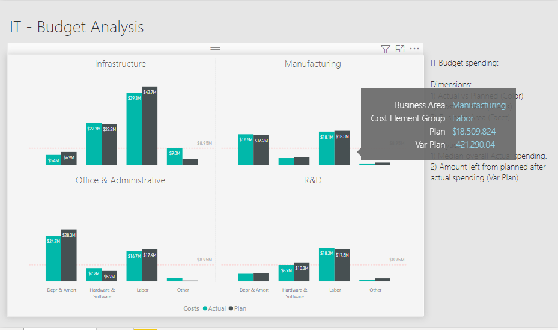
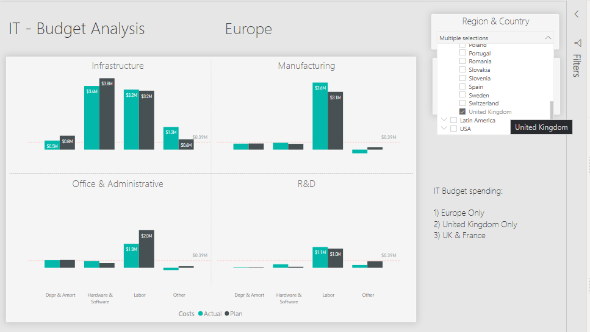

# Virtual Machine (VM) Exercises

## 1st VM Exercise

#### Dataset

- [ ] Add datasets used to the `datasets/` folder

#### Files

- [ ] **Initial**: Add file to the `exercises/`  folder with the name `ex-1-intial.twbx` or `ex-1-intial.pbix`, depending if you are auditioning for a Tableau or Power BI course.
- [ ] **Solution**: Add file to the `exercises/`  folder with the name `ex-1-sol.twbx` or `ex-1-sol.pbix`

#### Learning Objective

*Enhancing the original plot with Analytics.*

#### Motivation

*Often plots will need to show more information than whats represented on the available dimensions. Analytics and Tooltip both are the available options in this case. Analytics are used to draw an extra element that is calculated from the values submitted to the visual. Tooltip can include new ready calculated values and it will show data point specific results.*

#### Steps to be executed by the student (max 6)

*Each bulleted instruction is a complete sentence that describes a specific task.*

- Select the visual and go to Analytics section of the lower part of the visualizations pane
- Click on Median line option and select (+Add) and rename to Median
- Choose the measure to be Actual 
- Choose the color(#fec0bf), style(Dotted), transparency(15%) and position(behind)
- Turn on Data label and choose color(#fec0bf), text(Name and value), Hotizontal position(Right), Vertical Position(Above), Display units(Millions), Decimal(2)

#### End goal:

## 2nd VM Exercise

#### Dataset

- [ ] Add datasets used to the `datasets/` folder

#### Files

- [ ] **Initial**: Add file to the `exercises/`  folder with the name `ex-2-intial.twbx` or `ex-2-intial.pbix`, depending if you are auditioning for a Tableau or Power BI course.
- [ ] **Solution**: Add file to the `exercises/`  folder with the name `ex-2-sol.twbx` or `ex-2-sol.pbix`

#### Learning Objective

*Creating 2 level slicers with matching formating.*

#### Motivation

*Slicers are considered an integral tool for any interactive report. Slicers can be multi-leveled to filter on multiple indicies.
They can take different forms, for example buttons or dopdown list, in this excercise we will create a dropdown list. 
Choosing the right selection options depends on the use case and in this excercise we will allow multiple slection by ticking.*

#### Steps to be executed by the student (max 6)

*Each bulleted instruction is a complete sentence that describes a specific task.*

- Click on the slicer option, move the visual to the desired location and adjust its size
- Drag [Sales Region] column from 'Country Region' table and drop it in the Field input area for the slicer and repeat the same for [Country/Region] column and drop it below [Sales Region]
- Click on the small downward arrow that is on the right side of the slicer's title and select dropdown
- Go to Format section on the visualization pane and open Selection Controls menu and turn off Multi-select with CTRL
- Trun off the Slicer header option and turn on the Title option and add "Region & Country" in the text field
- Select the Visualization card titled "Plan" and click on Format painter from the home menu in the header tool bar then click to apply the same format on your slicer.

#### End goal:

